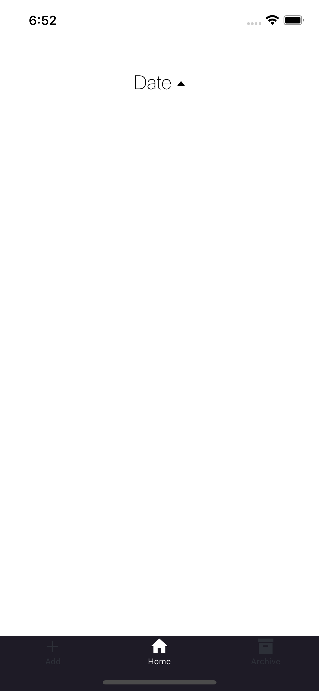
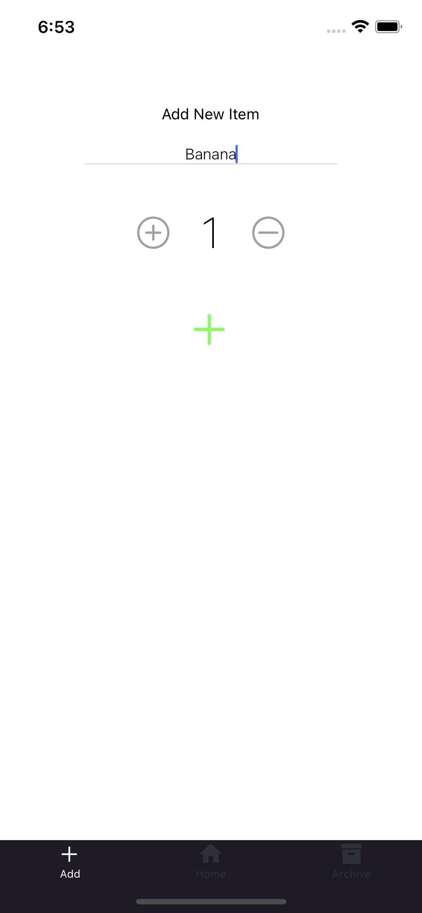
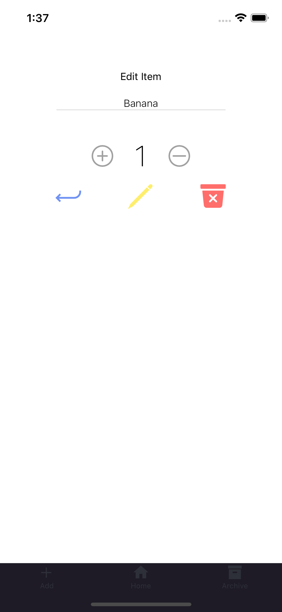
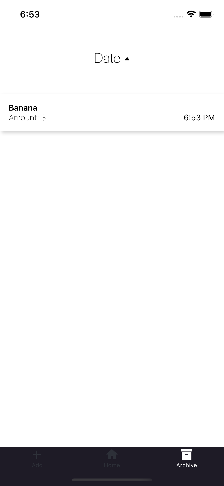

# ShopingList using React native

### Simple **react native** shoping list using **redux** 
Redux using persist storage for stroing items. 

 

 

## Setting up tools

1. Install **Node.js** and **NPM** 
2. Install **Expo**
   
        npm install -g expo-cli
3. Install **Yarn**

        npm install --global yarn

---

## Setting up dependencies 
1. Install **node_modules** needed for this project 

        yarn

---

## Running the project
    expo start

---
## Testing the project

    npm test

--- 

## Project overview

 

### **Home screen**
 

If items is there you can swipe list item left or right to archive or edit

 

 

 

### **Add Screen**

 

Set title of element, if title is set amount counter will appear, if ammount counter change and be grater than 0 add button appear

 

 

 

### **Edit screen** 

 

Edit screen can be access from home screen when swipe element to left 

 

 

 

### **Archive**

 

In archive will appear elements after swiped out right in **home screen**

Elements from this screen can be swiped left or right depends if want to unarchive element or delete element

 

 

 

